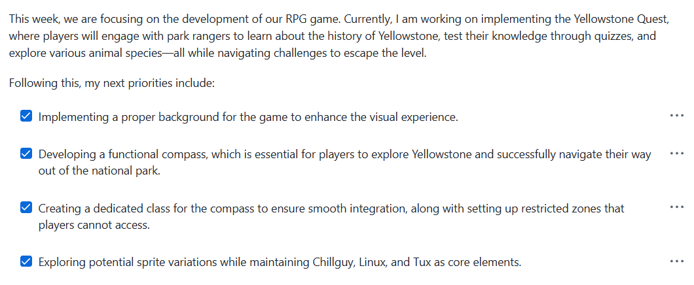
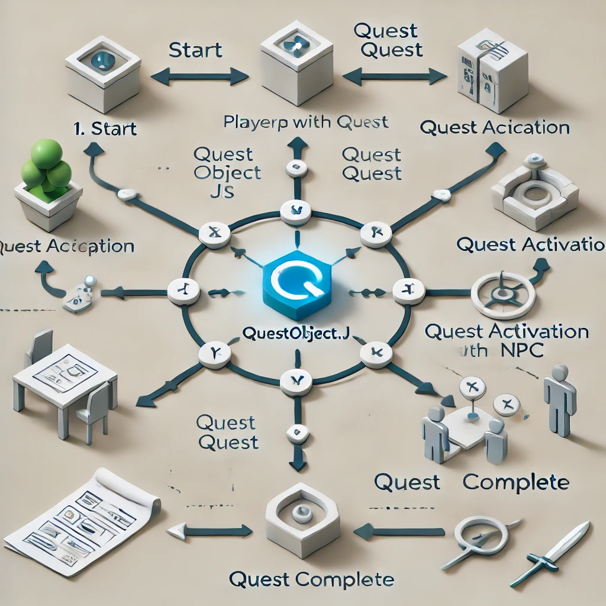

Requrments

5 points - 5 things you did over 24 weeks, Skills learned, Issues, Burn Down, Lesson(s) taught, Live Reviews presentation(s) given, GitHub analytics, 8 blogs mentioned above, organizing all. of this in your blog
2 point - Latest Game Feature
1 point - Latest Game Feature blog write up, plus visualization of code understanding (using drawIO)
1 point -  N@tM feedback from your demo, we are hoping for adult feedback or Computer Science student feedback (5 - 10 points of feedback)

## Accomplishments
One of my key accomplishments was implementing a Mini Quest System. While it took time and extensive debugging, I developed core debugging skills that greatly improved my problem-solving abilities. 

## ScavengerObject.js
This script plays a crucial role in storing and managing quest-related data, ensuring seamless functionality and system integration.

## QuestsNPC.js
This system defines NPC behaviors, interactions, and quest roles, ensuring a dynamic and immersive player experience by handling diverse quest types and character interactions.

QuestObject.js
Completing the Quest Object was a major milestone, serving as the backbone for quest management, updates, and UI interactions. Though functional, I now see ways to refine and enhance its efficiency and flexibility in future iterations.

## Skills I Learnt

## Fundamentals of JavaScript
I learned to use iterations, Booleans, and arrays to develop my game. This hands-on experience expanded my coding skills, making last trimester a fun and insightful journey in JavaScript.

## Classes
Classes are essential in JavaScript, making my quest system more organized and manageable. They function as an advanced version of JSON objects, allowing me to store, update, and manage quest data efficiently in QuestSystem.js.

## Extend
Using extend, I built new classes from existing ones, such as ScavengerObject.js and QuestNpc.js, by inheriting properties from GameObject.js and Character.js. This reduced redundant code while enabling dynamic expansion of objects and NPCs.

## Class Methods
Class methods allowed my custom classes to have unique functions, reducing repetitive code. They enable specific operations like Car.Drive() or Object.Destroy(), making my codebase more structured and maintainable.

## Burndown Lists
To stay on track while developing my quest system, I used a checklist. This helped minimize procrastination and allowed me to jump straight into coding with a clear plan.
an eg of burndown list 

## Latest Game changes

The game changes were weird as I first worked on having background and adding music along with working on compass but I felt It wasn't enough so I went back and forth and the draw IO sucked so I decided that to look at other people IDea and ran into William idea and decided i don't care if it challenge I will work hard on it and implment in my game and here is my new draw io 

## the work I liked most
William's work is well-organized, with each of his blogs structured thoughtfully, unlike Ethan or Cason. He puts effort into his game, which I really appreciate.

| Topic                   | Score (0/1) | Reflection  |
|-------------------------|------------|-------------|
| **OOP**                | **0.75**    | "OOP was used in some places like ScavengerObject, but I completely ignored it in Quest.js where it was actually needed.".js. |
| **Classes (OOP)**       | **0.8**     | I understand classes well, but I overused static methods. This worked for QuestSystem.js but was a poor choice for Quests.js." |
| **HTML**               | **0.8**    | The quest output looks great, but I left a UI issue—empty text still renders an empty box instead of hiding itself. |
| **Sprites**            | **0.77**     | All sprites are static, displaying only a single frame. The tux NPC has a wave animation, but I didn't apply animation to anything else except replacing the tux. |
| **Optimization**       | **0.85**     | I reduced unnecessary checks by making quest conditions trigger on collision instead of running every frame. Huge performance boostunnecessary computations. |
| **Error Handling**     | **0.93**     | "I can efficiently backtrack errors, from simple typos to complex issues spanning multiple JS files. Debugging skills are solid |
| **Testing & Debugging** | **0.95**     |  methodically tested and debugged, ensuring code sections executed properly, conditions were met, and quests displayed as expected. |

## future imporovment

| Feature            | Changes                |
|--------------------|------------------------|
| Quest tracking system  | MAybe making like checklist and automatically  ticks the quests rather than fat box |
| More Quest Types          | I would with enough time would have created map and made them colelct more quests or interact with Npc |
| More Npcs | I would with enough time would have had diffrent Npcs with diffrent  animationsn|
| PLayer Movment |What I could HAve done was make my player slow down and constant rather than speeding up making sure they don't go past NPC |
