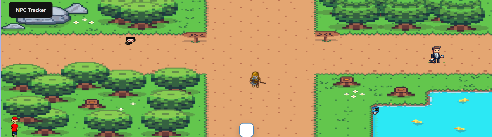
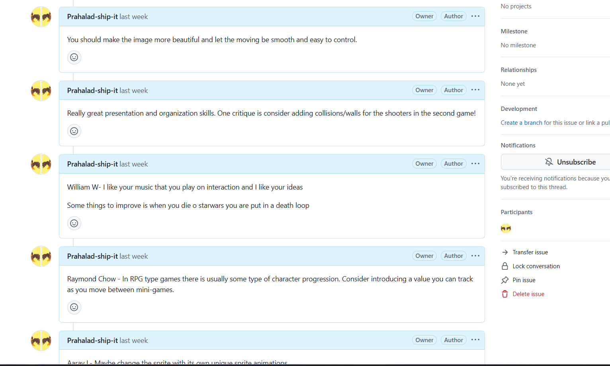

## **Requirements**
- **5 points** – 5 things I did over 24 weeks: skills learned, issues, burndown lists, lessons taught, live reviews, GitHub analytics, blogs.
- **2 points** – Latest game feature.
- **1 point** – Blog write-up on the latest game feature with code visualization (drawIO).
- **1 point** – N@tM feedback (preferably from an adult or CS student).

---

## **5 Skills I Learned**

1) Fundamentals of JavaScript
I learned to use iterations, Booleans, and arrays to develop my game. This hands-on experience expanded my coding skills, making last trimester a fun and insightful journey in JavaScript.

2) Classes
Classes are essential in JavaScript, making my quest system more organized and manageable. They function as an advanced version of JSON objects, allowing me to store, update, and manage quest data efficiently in QuestSystem.js.

3) Extend
Using extend, I built new classes from existing ones, such as ScavengerObject.js and QuestNpc.js, by inheriting properties from GameObject.js and Character.js. This reduced redundant code while enabling dynamic expansion of objects and NPCs.

4) Github

Through the training I received, I learned how to use GitHub and VS Code. Initially, I struggled with VS Code, but I eventually got the hang of it. Now, I'm proficient in committing code and using GitHub, which has proven to be a great tool. 
 

5) Burndown Lists
To stay on track while developing my quest system, I used a checklist. This helped minimize procrastination and allowed me to jump straight into coding with a clear plan.
an eg of burndown list 

---

## **Latest Game Changes**
Initially, I worked on **backgrounds, music, and a compass** but felt it wasn't enough.  
- I **revised my approach**, inspired by William’s project, and added **new mechanics**.  
- I worked hard to implement **a better quest system**.  
- My new **drawIO diagram** reflects this updated game structure.  
- 

---

## **Work I Liked Most**
William’s **well-structured blogs and game development** were inspiring.  
- His **Adventure Game** helped me understand **quest systems** better.  
- His code was **clear and well-documented**, making it easy to follow.  
- Reviewing his game helped me **analyze my own coding practices**.  
- 

---

## **Future Plans in Computer Science**

Right now I don't if I am going to take CSP or CSA i am still deciding however I am taking a JAvascrpit online course to learn about BAsics of JAvaScript and deepn my understanding about JavaScripit is on Cousera for free so I can apply and pratice hoepfully do CSP or CSA online or in community college. 

## N@TM 

At N@TM I had so many suggestion even though there were only six comment one paticulary caught mine Aaadi Bhat liked my game and told me that you could have a auest system with William Inspiration and Aadi idea I went to  work and here his comment. (Aadi B - Very exciting project, I like how you used music to make it more interesting. I would add a feature to the blue character that could give the player a quest. Overall great job!)

---

## **Self-Grade Assessment**
| Assignment                | Learning process                          | Grade | 

| Last 24 weeks overview    | Shown below and in GitHub analytics       | 4     | I have been pretty good at my work but need improvements.           |

| Latest game feature       |                | 1.7   | It is almost identical to William's, but I worked hard to code it.  |

| Organization              |                                           | 0.85  |  Could have made it better, but it looks great. |

| N@TM feedback             |                  | 0.81  | It has been great, but I could have gotten more reviews. I have done well. |

| Total                     |                                           | 7. 7   |                                                                     |                                                                                           