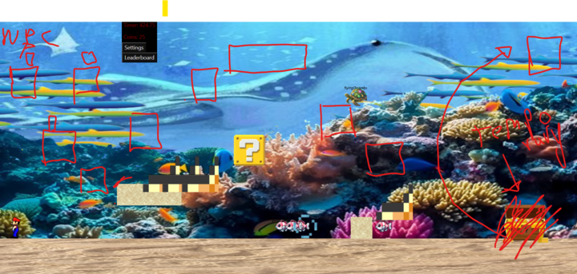
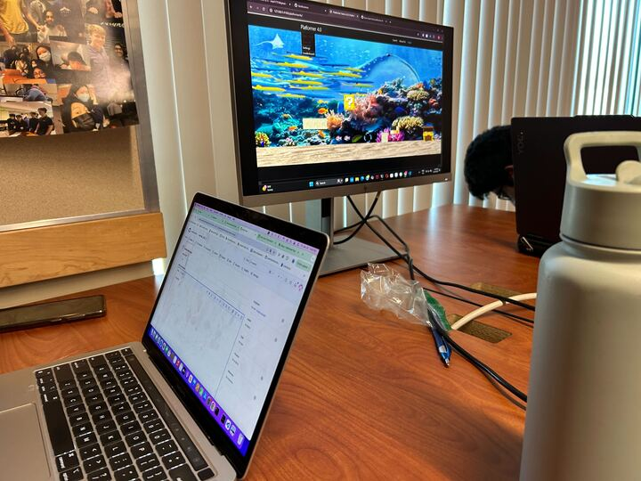

## Sprint 6: Weeks 18 and 19 (1/13 - 1/24)

### Week 18: Accomplishments and Challenges

**Creating the Help System:**  
While there’s definitely room for improvement, we poured a lot of effort into building it, and we’re proud of the progress we’ve made. It was a great learning experience, and we’ll use this as a foundation to refine and improve the system in the future.

**Working on the Game Ending:**  
One idea I had was a door transforming into something dynamic, which then becomes the way to exit the level. Here’s the video showcasing it! There’s potential to make the sequence more seamless and impactful, but I’m excited about the creative direction it’s taking so far.

### Sprint 6 Video Journal

[Watch the Sprint 6 video demonstration on YouTube](https://www.youtube.com/watch?v=BIssw9cw3xg)

### Week 19: Continued Development (1/21 - 1/24)

Our team is actively developing the game's ending, ensuring that players must collect all coins and potentially interact with the NPC to progress. I am refining the design to enhance clarity and accessibility while preserving the intended challenge.

(FYI It is a little messy but it is just a rough draft so our team can meet all those ideas and then we can later work on different ideas later)



### Our Failures

I personally felt that the team’s contributions were lacking, leaving me to handle the majority of the work. Given the critical importance of this aspect for the future, I immediately called a meeting on Friday afternoon. During our discussion, we concluded that the level was mediocre and needed significant improvements. We are now focused on refining its design to enhance both visual quality and gameplay accessibility while ensuring stability and preventing potential crashes.

Here is a photo of us working together to make sure we met standards:


```
Week 20

This week I was working on the game and focused on improving my score.

Mr. Mortensen rewarded my hard work with a good score.
I am working on the RPG game, with no current plans for other projects.

Yellowstone National Park will be a key location for both levels.
I’m creating Yellowstone Imagination, a simplified survival game.

The main focus is on exploration rather than survival.
Key features include:

Compass to guide the player toward the exit.
Restricted zones based on real-life Yellowstone off-limits areas.
The background design is interesting, but I will improve it for a more immersive experience