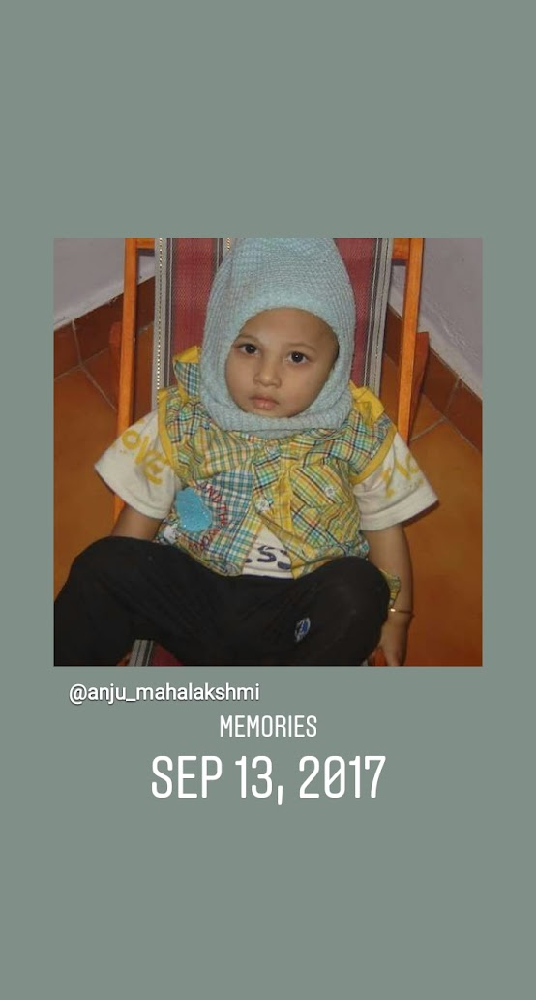

## As a conversation Starter

Gandhinagar and San Diego
<comment>
Flags are made using Wikipedia images
</comment>

<!-- This grid_container class is used by CSS styling and the id is used by JavaScript connection -->

    <!-- content will be added here by JavaScript -->

### Journey through Life

Here is what I did at those places

- 🏫 Lots of Elementary Schools in Ganhinagar up till 4th grade and fifth grade here at Turtleback Elemenetry
- 🏫 Middle and High School in Bernado Heights Middle School and 9th grade at Rancho Bernado
- Current School Del Norte Sophmore Year graduating 

### Culture, Family, and Fun
My family is From South India
My Mum is from Andhra Area in Konasemma District I believe
My Dad is from Telangana In Hyderbad

### Facts
- I am 15 year old person who loves cricket yes pls givew me bat and ball I will smash you like Sewhag  
- I freaking love to cook I am foodie 
- I love helping people during hard times 
- I love biolgy 
- I love my dad mum and sister they are greatest being and supportive of me during tough times
- I love the West love yellowstoe my favorite game is yellowstone unleashed. 
- I hope you have nice day bye 

- Image gallery 
  - 
  - 
  - 

